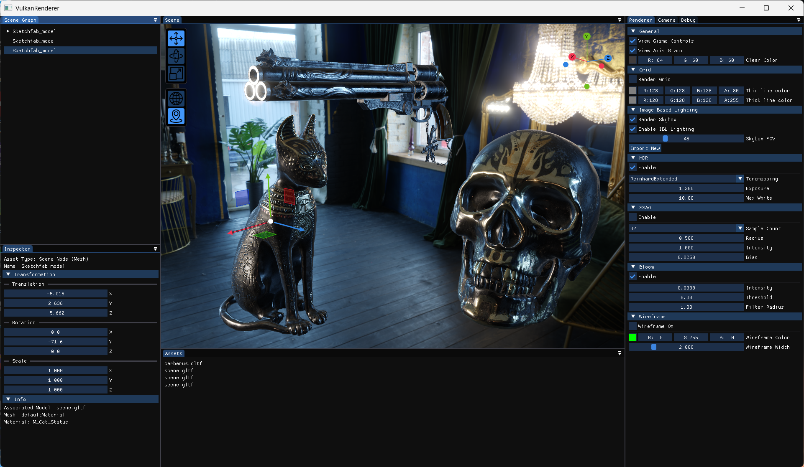
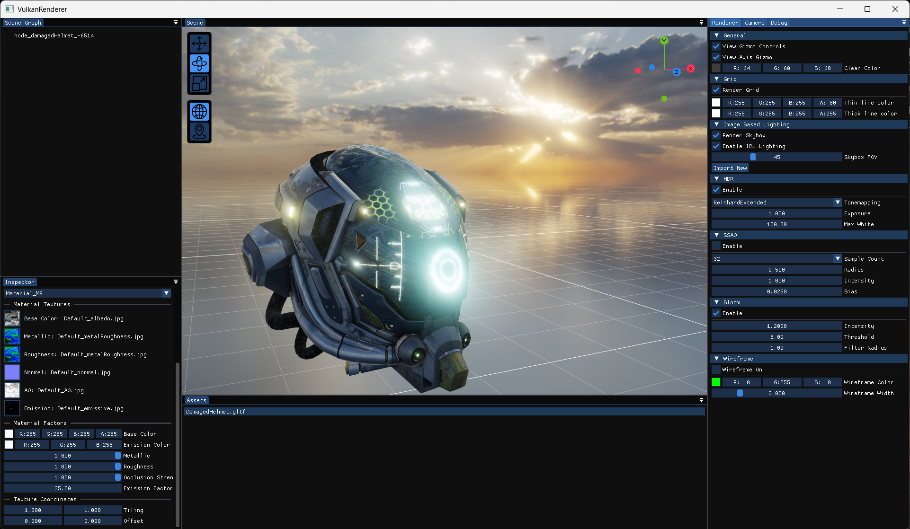
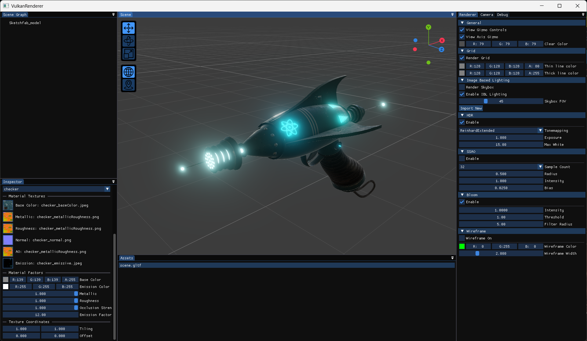
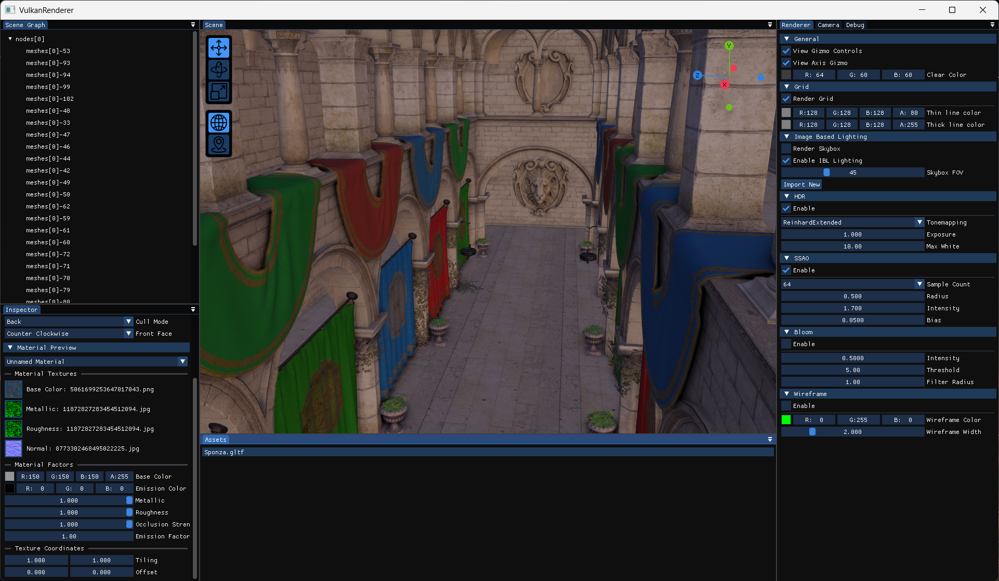
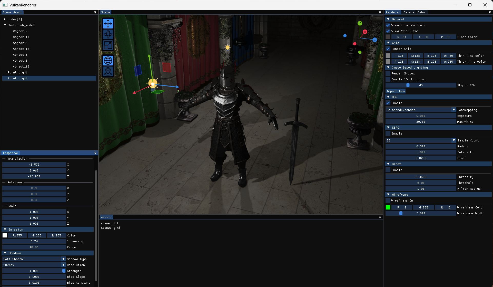

# Vulkan Rendering Engine

A physically based forward+ rendering engine made with C++ using the Vulkan API.

## Features

Implementation of a variety of rendering techniques:
- Physically based rendering using the metallic workflow
- Image based lighting
- Bloom
- Screen space ambient occlusion (SSAO)
- Cascaded shadow mapping
- Omnidirectional shadow mapping
- Skybox
- MSAA
- HDR

Optimizations techniques:
- Instanced rendering
- Compute based light culling
- Asynchronous GLTF model loading
- Face culling
- Depth prepass + early depth test

Implementation of an editor:
- Functional scene graph that contains node creation, drag and drop, copy-pasting, renaming, and deleting
- Infinite grid
- Transform gizmos
- Coordinate system gizmo
- World space light icons
- Camera with view and first person modes

## Download

The built project binaries can be found in the Releases section. Download the zip and run the executable.

## Build

- To build the project from scratch, use Clion and mingw. The project has not been configured for Visual Studio and MSVC.
- The Vulkan SDK needs to be installed. All other dependencies are included in the project.
- Set the target to "All targets" and build.

## How to Use

- The built binaries includes some sample models. To render a model, drag and drop it into the "Scene" panel. 
- The build binaries also include a loaded environment map for image based lighting. For that, click "Render Skybox" and
  "Enable IBL Lighting" in the "Renderer" panel. 

### Model Loading

- To load a model, right click inside the "Assets" panel and select **import**. That will open an import dialog with some
  import options. Select the model and click **Ok**.
- Right-click on a loaded model to delete or rename it. 
- Left-Click on a model to highlight it. Highlighted models will show up in the "Inspector panel".
- The model's details can be viewed in the inspector.
- The model's material properties can be manipulated in the inspector.
- Only the GLTF file format is supported (*.gltf, *.glb).

### Environment Map Loading 

- To load a new environment map, click "Import New" under the "Image Based Lighting" header in the Renderer panel.
- Only equirectangular HDR images are supported (*.hdr).

### Scene Graph

Use the following options to manipulate the node hierarchy of the scene graph:
- Drag and drop to move nodes. To make a node a root, drag it onto the empty space at the bottom of the panel.
- Click on a node to highlight it. Highlighted nodes will show up in the inspector panel, where their transform and
  other options can be manipulated.
- Press right click inside the Scene Graph panel to spawn a popup menu. The following functionality is included:
  - Cut, copy, paste, duplicate
  - Node renaming
  - Node deletion
- The following node types can be created through the popup:
  - Empty nodes
  - Light nodes: directional, point, and spot
  - Nodes generated from a loaded model

## Preview Photos

### PBR + Image Based Lighting

### Bloom Effect

### Screen Space Ambient Occlusion (SSAO)

### Shadow Mapping

